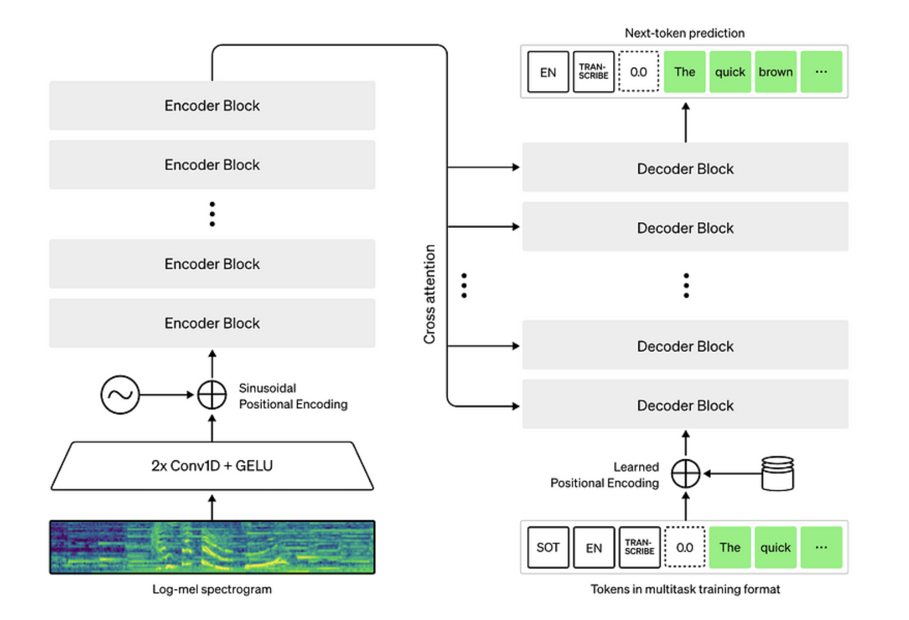
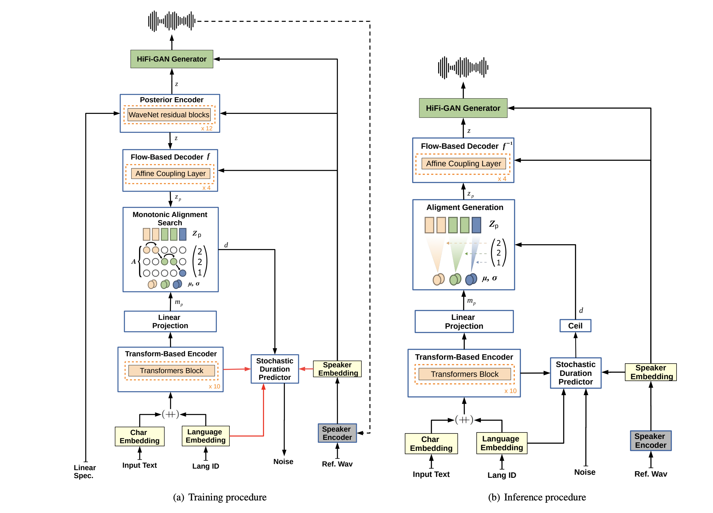
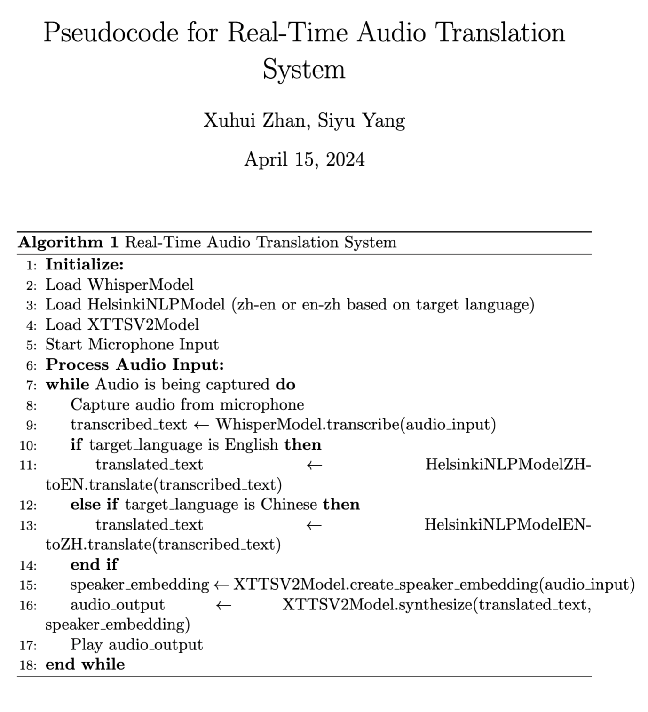

# Real-Time Audio Translation System

## Author: Xuhui Zhan, Siyu Yang

This repository contains the implementation of a real-time audio translation system designed to seamlessly translate audio content between Chinese and English. The primary goal of this system is to facilitate effortless communication between speakers of these two languages. Additionally, the system generates intermediate files that can serve as initial datasets for training text-to-speech (TTS) models. This capability opens up further possibilities, such as developing models that could translate songs from Chinese to English and vice versa, enhancing cross-cultural music accessibility.

## 1. Background Information

### 1.1 Overview
Our Real-Time Audio Translation System is engineered to bridge the language gap between Chinese and English speakers through instantaneous audio translation. Beyond basic translation, this system uniquely preserves the vocal characteristics of the original speaker, ensuring that the translated audio retains the speaker's intonation and style. This feature enriches the communication experience, making interactions more natural and engaging.

The system's dual functionality not only supports real-time conversation between diverse language speakers but also facilitates the creation of valuable datasets. These datasets consist of translated text and audio files that are ideal for training sophisticated Text-to-Speech (TTS) models. Such models can learn to mimic the nuances of spoken language in various applications, including the ambitious goal of translating and reproducing songs in different languages while maintaining the original artist's expressive vocal traits.

This project aims not only to simplify communication across linguistic boundaries but also to push the boundaries of how we interact with and experience language in multimedia and entertainment, fostering a deeper cultural exchange.

### 1.2 Challenges

#### Real-Time Processing Demands

Achieving near real-time audio translation on standard CPU hardware is inherently challenging due to the computational intensity of processing audio data, translating text, and generating speech in a seamless flow. These operations typically require significant computational resources, which can be a limiting factor in real-time applications.

#### Maintaining Translation Accuracy

High accuracy in audio translation involves complex linguistic and technical challenges, especially when dealing with idiomatic expressions, varied dialects, and context-dependent meanings. Ensuring the translated output remains true to the original intent and meaning is critical for effective communication and requires advanced linguistic processing capabilities.

#### System Complexity and Modularity

The system's architecture is divided into three main modules: audio-to-text, text-to-text translation, and translated text-to-audio generation. Each module must not only perform efficiently on its own but also integrate smoothly with others, complicating the design and maintenance of the system. This modularity, while beneficial for updates and scalability, adds layers of complexity in development and testing.

#### Preserving Speaker Characteristics

One of the most advanced goals of our system is to not only translate spoken content but also to retain the unique vocal characteristics of the original speaker in the translated audio. This involves capturing subtle nuances such as emotion, tone, and rhythm, which are difficult to encode and reproduce accurately across languages.

#### Data Availability for TTS Model Training

Training sophisticated text-to-audio models to mimic the original voices accurately requires large volumes of high-quality, varied audio data. In many linguistic contexts, such datasets are scarce or incomplete, posing significant challenges in model training, especially for less common languages or dialects.

### 1.3 Existed Solutions

1. Google translater
2. Real time translator on Github

## 2. Demostration

#### Let' s play with the system!

*Check example input and output files and intermediate saved files in the `examples` folder*

**Usage:**

`pip install -r requirements.txt`

`python app.py`

## 3. Method

### 3.1 Audio to Texts (Whisper)

**Huggingface model card: https://huggingface.co/openai/whisper-base**

The Whisper model is an advanced automatic speech recognition (ASR) system developed by OpenAI, utilizing a transformer-based encoder-decoder architecture to convert audio into text. This model excels in robustness across a variety of audio types and languages due to training on a vast dataset comprising 680,000 hours of diverse, multilingual audio content. ([OpenAI](https://openai.com/blog/whisper/))

#### Model Overview
Whisper processes audio by initially converting it into a log-Mel spectrogram. This serves as the input to the encoder within the transformer architecture. The encoder generates hidden states that are passed to the decoder, which sequentially generates the text transcription of the audio. This end-to-end process is equipped to handle both speech recognition and translation tasks, enhancing Whisper's versatility for multilingual applications.

#### Advantages of Whisper
One of the main advantages of Whisper is its high accuracy in transcription across various languages and dialects, robust against background noise, accents, and technical language. The model's multilingual capabilities significantly enhance its utility globally, especially in regions with scarce resources for certain languages. Moreover, Whisper's open-source availability allows developers to adapt and integrate the model into their projects, providing a foundation for customization based on specific needs. ([Model Explaination in details](https://www.louisbouchard.ai/whisper/))

This combination of versatility, performance, and accessibility makes Whisper a powerful tool in speech recognition and translation, ideal for projects that require reliable transcription in diverse and challenging audio environments.

### 3.2 Texts to Texts (Helsinki-NLP)

**Huggingface model card (zh-en): https://huggingface.co/Helsinki-NLP/opus-mt-zh-en**

**Huggingface model card (zh-en): https://huggingface.co/Helsinki-NLP/opus-mt-en-zh**

This section of the project leverages the Helsinki-NLP models from the OPUS-MT project hosted on the Hugging Face Model Hub. These models are specifically `Helsinki-NLP/opus-mt-zh-en` for translating Chinese to English and `Helsinki-NLP/opus-mt-en-ch` for translating English to Chinese. 

#### Model Overview
The Helsinki-NLP/OPUS models are part of a series designed to provide efficient and accessible machine translation capabilities across a wide range of language pairs. These models are built using the Transformer architecture, which is renowned for its effectiveness in understanding context and generating coherent translations.

#### Advantages of Helsinki-NLP/OPUS Models
- **Wide Language Support:** Capable of translating between numerous language pairs, these models are particularly powerful for projects involving diverse linguistic inputs.
- **Open Source:** Freely available for use and adaptation, they are ideal for academic, commercial, or personal projects.
- **Performance:** Provides robust translation accuracy, making them suitable for real-time translation tasks in applications.

For detailed documentation on how to implement these models into your project, visit the [Hugging Face Model Hub](https://huggingface.co/Helsinki-NLP).

### 3.3 Text-to-Speech (XTTS-V2)

**Huggingface model card: https://huggingface.co/coqui/XTTS-v2**

This section of the project focuses on converting translated text into spoken audio using the `tts_models/multilingual/multi-dataset/xtts_v2` model. This advanced model is designed to deliver high-quality speech synthesis and can mimic voice characteristics from input audio, enabling more personalized and natural-sounding output.

#### Model Overview

The `tts_models/multilingual/multi-dataset/xtts_v2` model is a state-of-the-art text-to-speech system that uses deep learning to produce natural-sounding speech. It is part of a broader initiative to develop versatile, multilingual TTS systems capable of handling diverse datasets and delivering clear, lifelike voice outputs.

#### Unique Features of the xtts_v2 Model
- **Voice Mimicking:** Capable of capturing and mimicking the voice characteristics from input audio, this model can reproduce specific vocal tones and styles, making it exceptionally useful for applications that require a consistent voice output matching original audio sources.
- **Multilingual Capabilities:** Supports multiple languages, making it suitable for global applications that need to cater to various linguistic groups.
- **High-Quality Audio Output:** Generates clear and natural voice outputs, which enhances user engagement in applications like audiobooks, virtual assistants, and interactive games.
- **Adaptability:** Designed for flexibility, the model can be fine-tuned to specific voice characteristics or further trained on specialized datasets to meet the unique requirements of different projects.

## 4. System Psudocode

## 5. Project Demo

Check the `demo.ipynb`
## 6. Future Works

1. **GPU Acceleration:** Leverage the GPU on computers to significantly accelerate processing times, enabling faster real-time audio translation and handling of complex tasks concurrently.

2. **Advanced Modeling:** Explore the integration of more complex models in each component of the system to enhance overall performance and accuracy in transcription, translation, and speech synthesis.

3. **Audio Preprocessing Enhancement:**
   - Implement advanced audio preprocessing techniques to reduce background noise in the input audio. This will help ensure that the noise does not merge with the speaker's voice, which can degrade the quality of the output audio and affect the voice mimicry accuracy.

4. **End-to-End Solution Development:**
   - Utilize the saved input and output files to develop robust end-to-end solutions. This approach will streamline operations and potentially improve system responsiveness and efficiency.

5. **Automated Audio Processing:**
   - Automate the audio capture and processing workflow using threading to handle multiple tasks simultaneously.
   - Integrate large language models (LLMs) in the backend to align and refine transcripts, such as combining truncated sentences into coherent wholes, enhancing the contextual accuracy of the output.

6. **Data Utilization for Model Training:**
   - Use the intermediate files generated during the translation process as initial datasets for training new models. This approach provides a valuable resource for model refinement and development.
   - Augment these datasets with high-quality data from sources like audiobooks to further enhance the model performance and ensure the synthesized speech is natural and engaging.

These initiatives will push the boundaries of what our real-time audio translation system can achieve, making it more robust, efficient, and versatile for users across different environments.

## 7. References

### Whisper Model by OpenAI
- **Original Paper:** "Robust Speech Recognition via Large-Scale Weak Supervision" provides a detailed explanation of the Whisper model's development and its capabilities across different languages and tasks. [Read the paper](https://openai.com/research/whisper).
- **GitHub Repository:** The open-source code and comprehensive documentation for the Whisper model are available on GitHub. This is essential for anyone looking to integrate or modify the Whisper model in their projects. [View the repository](https://github.com/openai/whisper).
- **Demo:** Explore the capabilities of the Whisper model through interactive demos available online, such as on Hugging Face, showcasing its performance in speech recognition and translation. [Try the demo on Hugging Face](https://huggingface.co/openai/whisper-large).

### Helsinki-NLP Models
- **Original Paper:** "OPUS-MT – Building open translation services for the World" by Jörg Tiedemann and Santhosh Thottingal details the creation of numerous machine translation models under the Helsinki-NLP project, aiming to provide open and accessible translation services. [Read the paper](https://aclanthology.org/2020.eamt-1.61.pdf).
- **GitHub Repository:** Helsinki-NLP maintains a repository containing several translation models, including the opus-mt models used for translating between Chinese and English. [View the repository](https://github.com/Helsinki-NLP/Opus-MT).
- **Demo:** Test the translation models directly through demos provided on platforms like Hugging Face, which offer real-time translation capabilities. [Try the demo on Hugging Face](https://huggingface.co/Helsinki-NLP/opus-mt-zh-en).

### XTTS-V2 Model by Coqui AI
- **GitHub Repository:** The XTTS-V2 model, designed for multilingual text-to-speech applications, is developed by Coqui AI. The repository includes all necessary files for using and adapting the TTS model. [View the repository](https://github.com/coqui-ai/TTS).

- **Papers:**

  - Merging Phoneme and Char representations: https://arxiv.org/pdf/1811.07240.pdf

  - Tacotron Transfer Learning : https://arxiv.org/pdf/1904.06508.pdf

  - Phoneme Timing From Attention: https://ieeexplore.ieee.org/stamp/stamp.jsp?tp=&arnumber=8683827

  - Semi-Supervised Training to Improve Data Efficiency in End-to-End Speech Synthesis - https://arxiv.org/pdf/1808.10128.pdf

  - Listening while Speaking: Speech Chain by Deep Learning - https://arxiv.org/pdf/1707.04879.pdf

  - Generelized End-to-End Loss for Speaker Verification: https://arxiv.org/pdf/1710.10467.pdf

  - Es-Tacotron2: Multi-Task Tacotron 2 with Pre-Trained Estimated Network for Reducing the Over-Smoothness Problem: https://www.mdpi.com/2078-2489/10/4/131/pdf

    - Against Over-Smoothness

  - FastSpeech: https://arxiv.org/pdf/1905.09263.pdf

  - Learning Singing From Speech: https://arxiv.org/pdf/1912.10128.pdf

  - TTS-GAN: https://arxiv.org/pdf/1909.11646.pdf

    - they use duration and linguistic features for en2en TTS.
    - Close to WaveNet performance.

  - DurIAN: https://arxiv.org/pdf/1909.01700.pdf

    - Duration aware Tacotron

  - MelNet: https://arxiv.org/abs/1906.01083

  - AlignTTS: https://arxiv.org/pdf/2003.01950.pdf

  - Unsupervised Speech Decomposition via Triple Information Bottleneck

    - https://arxiv.org/pdf/2004.11284.pdf
    - https://anonymous0818.github.io/

  - FlowTron: 

    https://arxiv.org/pdf/2005.05957.pdf

    - Inverse Autoregresive Flow on Tacotron like architecture
    - WaveGlow as vocoder.
    - Speech style embedding with Mixture of Gaussian model.
    - Model is large and havier than vanilla Tacotron
    - MOS values are slighly better than public Tacotron implementation.

  - Efficiently Trainable Text-to-Speech System Based on Deep Convolutional Networks with Guided Attention : https://arxiv.org/pdf/1710.08969.pdf

- **Demo:** Experience the capabilities of the XTTS-V2 model firsthand through an interactive demo provided by Coqui AI on Hugging Face. [Try the demo on huggingface](https://huggingface.co/spaces/coqui/xtts). 

## License

The system' s code and model weights are released under the MIT License. See [LICENSE](https://github.com/openai/whisper/blob/main/LICENSE) for further details.
